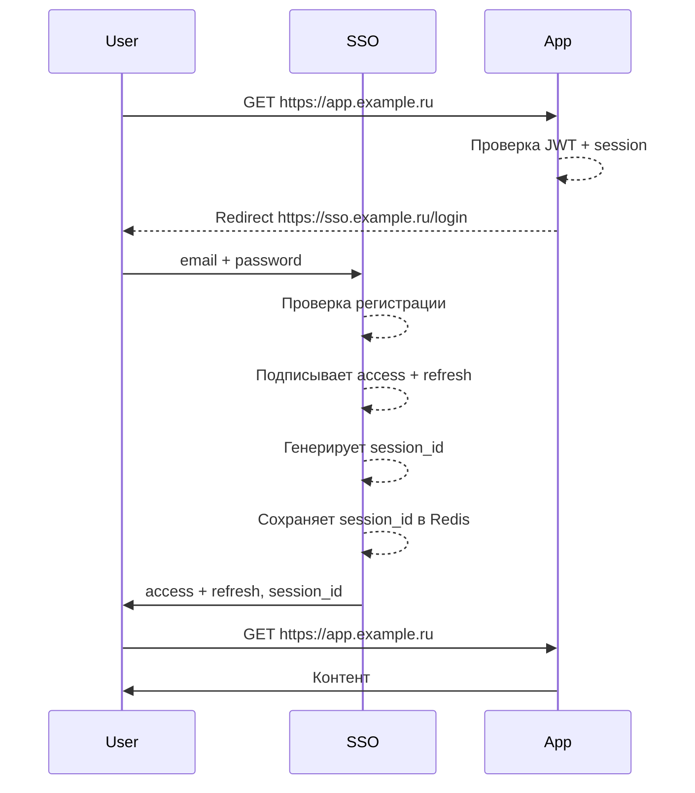

# Логика SSO аутентификации

### Простой сценарий аутентификации пользователя.

1. Пользователь отправляет запрос к приложению (приложение не как отдельный микро-сервис, а полноценный продукт).
2. При запросе требующем аутентификацию, приложение проверяет наличие <b>access токена</b>. Если токена нет - то происходит redirect пользователя на <b>SSO</b>.
3. Пользователь вводит email и пароль (также аутентификация может происходить через сторонние сервисы)
4. После успешной проверки регистрации SSO сервис подписывает пару access + refresh токенов и закрепляет id сессии в Cookie. 
   (session_id нужен для перехода между realms, т.е приложениями)
5. Пользователь передаёт access и session_id при каждом следующем запросе.
6. Приложение возвращает контент для аутентифицированного пользователя.