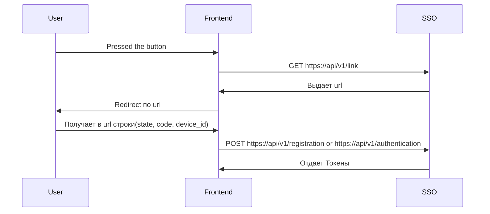

# Логика Работы Providers

### Сценарий работы пользователя, фронтенда и провайдеров.


## Подробнее

Базовый URL: '/{realm}/provider' (где **realm** название области системы, передаётся при каждом запросе)

## Получение URL

### GET '/link' 

Ничего не принимает, в url нет path параметра realm.

<b>Response</b>

 - **200 OK**

```json
{
   "какой то url"
}
```

## POST '/registration'

Регистрирует пользователя 

<b>Request</b><sup>required</sup>

Тело запроса

```json
{
   "code": "string",
   "state": "string",
   "и device_id если пользователь регестрируется через ВК": "string"
}
```

<b>Response</b>

 - **201 Created**

```json 
{
    
    "access_token": "string",
    "refresh_token": "string",
    "expires_at": "integer"
}
```


## POST '/authentication'

Аутентифицирует пользователя 

<b>Request</b><sup>required</sup>

Тело запроса

```json
{
   "code": "string",
   "state": "string",
   "и device_id если пользователь регестрируется через ВК": "string"
}
```

<b>Response</b>

 - **200 Created**

```json 
{
    
    "access_token": "string",
    "refresh_token": "string",
    "expires_at": "integer"
}
```
